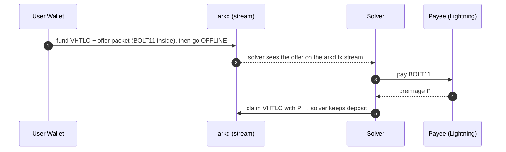
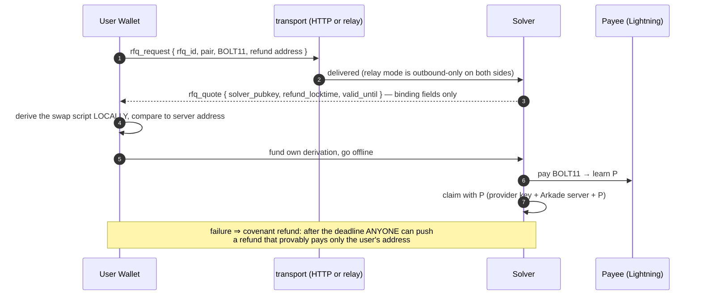
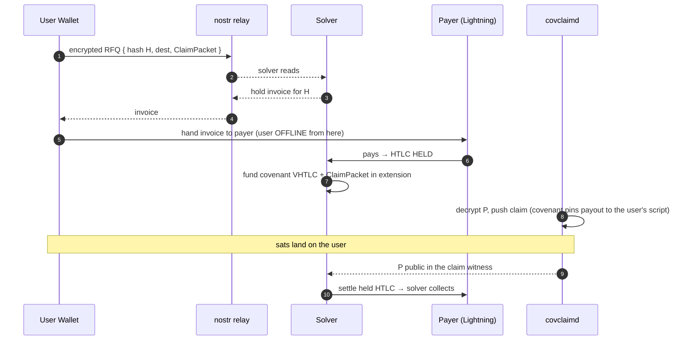

# Architecture — implemented today, and the intents end-state

The hand-drawn source of truth is [`architecture.excalidraw`](./architecture.excalidraw)
("Arkade Intents for LN" — open it at excalidraw.com). This page renders the
same two flows in Mermaid and, importantly, says **which parts are running code
and which are the target**. The diagram was reviewed against the implementation
on 2026-08-04 and re-verified on 2026-08-05; the verdict per element is the
table at the bottom.

Negotiation layer: **RFQ is the standard for all corridors** — Lightning,
cross-chain, arkade-to-arkade — and is specified end to end in
[`rfq-protocol.md`](./rfq-protocol.md). Stream/mempool offer discovery (the
"no API, no relay" flow drawn in the diagram) is rescoped to **liquid spot
pairs** (e.g. BTC/USD); it is a spot-market feature, not a pending evolution
of the Lightning legs.

Discovery is live through the **solver-registry corridor card** — a signed
rendezvous (`discovery_pubkey`, relays, per-market fee and limits) emitted
from live config by `cli card` (`src/core/registryCard.ts`) — and
multi-solver **broadcast bidding** (open RFQ → sealed bids → directed close)
is specified in [`rfq-protocol.md`](./rfq-protocol.md) § 4.6. The solver
side of it is implemented (`src/core/openRfq.ts`, the topic subscription in
`src/ingress/relay.ts`, rate-capped by `OPEN_RFQ_MAX_BIDS_PER_MIN`); the
client side lives in the ts-sdk, tracked in issue #4.

## SEND — Arkade → Lightning

The diagram's stream-discovery flow — *no API, no relay: the offer is
discovered on the arkd stream* — is the **spot-pair model**: the user funds a
VHTLC carrying an offer packet and goes offline; any solver that fills learns
the preimage `P` and claims with it, never learning `P` without actually
filling. It applies to pairs liquid enough for an open offer to sit on the
stream. The Lightning leg is **not** on that path — it negotiates by RFQ,
permanently. Kept for reference as the spot-market shape:

**Implemented today** — the same trade, discovered by request/quote instead of
by stream, and with a provider-keyed claim leaf:

## RECEIVE — Lightning → Arkade (RFQ over nostr, both sides outbound-only)

The RFQ messages, transport and settlement profile for this flow are specified
in [`rfq-protocol.md`](./rfq-protocol.md) (§ `lightning:BTC->arkade:BTC`).

The solver carries the ClaimPacket blindly — it is sealed to covclaimd and the
solver cannot decrypt `P`. The covenant pins the payout to the user's script, so
neither the solver nor covclaimd can redirect the funds. (That covenant —
`enforcePayTo` behind a tweaked emulator key — is the exact mechanism this repo
already uses for send-leg refunds, proven on mainnet and regtest.)

## Diagram vs implementation, element by element

| Diagram element | Status | Notes |
|---|---|---|
| Send: covenant VHTLC in a VTXO, user offline after funding | **Implemented** | Eight-leaf covenant script (the extended `VHTLC.ScriptV2` tree); live on mainnet (`bitcoin`) and regtest |
| Send: solver learns `P` only by paying | **Implemented** | Claim leaves are preimage-gated |
| Send: non-interactive refund (not drawn, implied by user-offline) | **Implemented** | Covenant refund pushable by anyone; emulator co-signs |
| Send: offer discovered on the arkd stream, no API/relay | **Rescoped: spot pairs only** | Stream discovery is the liquid-spot-pair model (e.g. BTC/USD), not a pending step for this leg — the Lightning legs negotiate by RFQ permanently ([`rfq-protocol.md`](./rfq-protocol.md)). `subscribeForScripts`/`getSubscription` verified available for when the spot flow is built |
| Send: open claim — ANY solver claims with `P`, keeps deposit | **Rescoped: spot-market feature** | Today the claim leaf carries the quoted solver's key, and under RFQ it stays that way. The open-claim leaf belongs to the spot-pair flow; its deposit/fee economics are still to design |
| Receive: RFQ over relay, both sides outbound-only | **Implemented** | The relay ingress + outbound WS client carry the `rfq_*` family on all four corridors (the only wire family — the pre-RFQ `ln_send_*` shape was removed unserved) |
| Receive: hold invoice for `H` | **Implemented** | `createHoldInvoice`/`getHoldState`/`settleHold` in the LN port + adapters, driven by `src/receive/orchestrator.ts` |
| Receive: ClaimPacket sealed to covclaimd; covclaimd pushes claim | **Implemented, covclaimd optional** | Wire protocol + ECIES documented in `environment.md`; covclaimd is a separate service, deliberately — this provider never accepts a preimage. The client holds the covenant's `receiver` key and can claim its own lockup, so a deployment runs correctly with covclaimd unset |
| Receive: covenant pins payout to the user's script | **Implemented** | Same covenant as send-leg refunds; both receive corridors fund through it |
| "nostr relay" specifically | **Implemented** | The Nostr codec (`src/relay/nostr.ts`) is the default relay dialect: NIP-01 `REQ`/`EVENT`/`CLOSE`, NIP-44-sealed directed traffic, wallet identity as the transport key. The dev broker framing remains behind `RELAY_PROTOCOL=dev` for integration tests |

**Verdict:** the diagram is consistent with everything built so far — nothing
in the running code contradicts it. Its two unbuilt elements, *stream
discovery* and the *open claim* leaf, are both rescoped to the liquid-spot-pair
flow rather than pending for the Lightning legs; those negotiate by RFQ
permanently, and the RFQ layer for every corridor is specified in
[`rfq-protocol.md`](./rfq-protocol.md). All four corridors — Lightning send
and receive, onchain send and receive — are implemented and driven by their
own orchestrators today.
