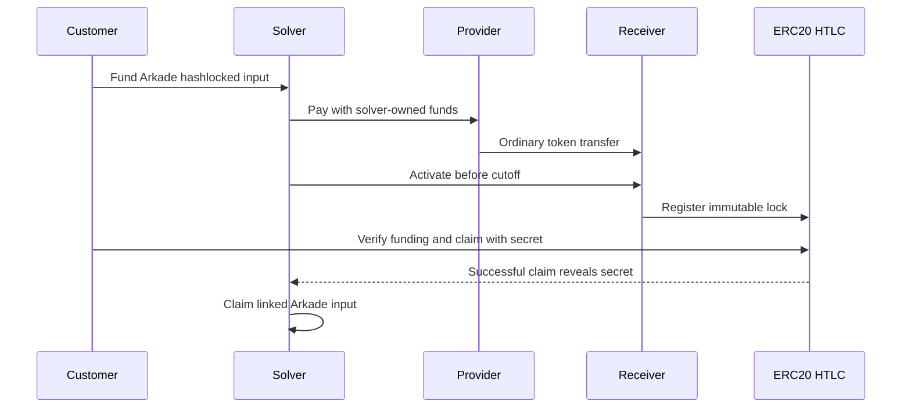

# Provider-funded EVM payout

An external execution provider can send an ordinary ERC-20 transfer to an
immutable per-intent receiver. The receiver then approves and calls the existing
Boltz `ERC20Swap.lock` operation. The customer claims that final-asset HTLC with
their own secret; the existing EVM send corridor observes the claim and uses the
secret to collect the Arkade input.

This path is opt-in through a registered rail’s `createEvmPayoutFunding` factory.
The built-in rails keep their existing funding path. Registering an adapter does
not deploy a public-chain receiver or enable a provider route by itself; the
consumer supplies its durable inventory, operator policy, and credentials.

## Ownership and settlement

The customer generates the outer secret. The solver never needs it to deploy,
fund, activate, or refund the receiver. Provider credentials and source-wallet keys stay
with the solver. The provider receives the solver's funds and knows the source
and destination payment details.

The receiver pins the chain ID, swap contract, token, exact payout amount,
customer claim address, solver refund address, payment hash, activation cutoff
block, activation cutoff timestamp and HTLC refund block. Both cutoffs precede
the input-side refund with the configured safety margin; the block cutoff also
leaves a configured minimum destination claim window.
A third party can activate or recover tokens, but cannot redirect either payout.

Provider completion, receiver balance and an activation transaction hash never
authorize an Arkade claim. The existing corridor's exact HTLC observations and
claim-preimage checks remain authoritative. Both configured confirmation depth
and age still apply.

## Components

| Path                                                         | Responsibility                                                                    |
| ------------------------------------------------------------ | --------------------------------------------------------------------------------- |
| `packages/solver-rails-evm/contracts/IntentReceiver.sol`     | Immutable receiver, one activation, bounded allowance, fixed recovery destination |
| `packages/solver-rails-evm/src/evm/receiver.ts`              | Constructor/deployment encoding and independent runtime/immutable verification    |
| `packages/solver-rails-evm/src/evm/receiverBackend.ts`       | Canonical finalized receiver snapshots, activation and recovery                   |
| `packages/solver-rails-evm/src/evm/durableSender.ts`         | Signed transaction journal, nonce reservation and exact replay                    |
| `packages/solver-rails-evm/src/evm/claimEvidence.ts`         | Successful canonical claim receipt, exact lock and preimage verification          |
| `packages/solver-core/src/core/evmReceiverFunding.ts`        | Policy gate over independently verified observations                              |
| `packages/solver-core/src/ports/evmPayoutFunding.ts`         | Provider-independent funding adapter contract                                     |
| `packages/solver-corridors-evm/src/send/evmPayoutFunding.ts` | Persisted-row binding and activation correlation                                  |
| `packages/solver-corridors-evm/src/send/evmOrchestrator.ts`  | Existing corridor, with alternate funding and independent recovery sweep          |

Adapters must persist the complete binding, provider quote, receiver identity,
cutoffs, source reservations and authorized attempt before sending funds. An
adapter resumed in reconciliation mode must not create a missing execution or
repeat an uncertain funding transfer. Its recovery sweep must retain provider
and receiver obligations after the customer row becomes terminal.

Quote authoring runs before the customer quote row is inserted. A failed insert
calls `abandonQuote`; successful unused quotes still require adapter expiry
maintenance. If deployment delays preparation, an adapter may return a fresh
expiry bounded by the configured validity interval. A persisted global deployment
budget must bound gas before any quote-triggered transaction is signed.

Changing or removing the adapter while its obligations exist is not a safe
rollback. Use the same adapter identity and durable database for settlement and
recovery; stop intake independently.

## Recovery and known limits

| Condition                              | Required behavior                                                                                |
| -------------------------------------- | ------------------------------------------------------------------------------------------------ |
| Less than required token amount        | No HTLC activation; top up within the window or recover after cutoff                             |
| Excess or duplicate token transfer     | Activate the fixed amount once; recover surplus to solver                                        |
| Delivery at or after activation cutoff | Activation reverts; tokens remain recoverable                                                    |
| Wrong token                            | Cannot satisfy the bound payout; recover the foreign token                                       |
| Ambiguous source transfer              | Reconcile the same persisted transfer identity; quarantine if unproven                           |
| Ambiguous activation                   | Read the exact lock/receiver and retained transaction; never infer failure from missing response |
| No destination HTLC at refund time     | Recover the provider/receiver leg, not an HTLC that does not exist                               |
| Provider refunds solver                | Still a solver treasury event; customer recovery remains the Arkade covenant refund              |

The underlying `ERC20Swap` claim branch remains callable after its refund block
until the lock is actually spent. Claim and refund can race. A failed or reverted
claim can disclose its preimage to a mempool observer. Chain outages, reorgs and
preimage disclosure can therefore cause losses even when transaction execution
is atomic. Clients must verify lock parameters/finality before exposing their
secret and leave the solver enough time to claim Arkade funds.

This composition protects the conditional customer exchange under the existing
HTLC and monitoring assumptions. It does not make the provider trustless or
remove solver working capital. Provider shortfall and fees are the solver's
liability; accepted customer payout terms cannot be silently reduced.

Only allowlisted normal ERC-20 tokens are candidates. Balance-delta checks reject
fee-on-transfer funding during activation; they do not make arbitrary rebasing,
blacklistable, upgraded or malicious tokens safe. Independently pin trusted swap
and token deployments as well as the receiver build. The runtime hash must be
derived from a trusted compiler artifact with bound immutable values, never
copied from the receiver being verified.

## Verification and rollout

`test/evm/receiver.test.ts` compiles the receiver and runs transactions on a local
EVM against the committed real `ERC20Swap` and WETH runtime fixtures. Core and
corridor tests cover funding/finality gates and preservation of the original
settlement ordering. These tests do not establish live provider interoperability
or replace an independent contract review. The receiver artifact is recompiled
and compared during the mandatory unit suite. The separate EVM E2E group also
executes the linked exchange against the real Arkade and EVM stacks.

Claim proof accepts direct calls and verifies smart-wallet/router claims against
successful `CALL` frames with the exact calldata, claimant and emitted event.
Indirect claims require `debug_traceTransaction` with `callTracer` and
`tracerConfig.withLog`; admission must prove this capability with
`assertEvmClaimTraceSupport` against a canonical recent token transaction.
Failure to obtain a proof leaves the claim unresolved. Use a dedicated execution
EOA and one durable SQL journal for every signed call.

The sender retains the original gas policy across restarts. An operator can
authorize `replace(id, request, fees, maxFeeCeiling)` to increase both fees by at
least 10% while keeping the same nonce, destination, calldata, value and gas
limit. Every signed attempt remains in the journal, and reconciliation checks
which hash actually mined, including reverted transactions. Monitor pending
attempts and reserve the authorized replacement gas before raising a ceiling.
Keep journal backups; completed rows currently remain in the database, so
`pending()` work grows with its history. Archive only after confirming every
attempt consumed its nonce and retaining the recovery record.

Independent contract review and artifact verification are mandatory before any
mainnet receiver deployment, including a smoke test. Merging this opt-in code
does not satisfy that gate.

Before registering a route:

1. Independently review the contract and reproducible artifact/address binding.
2. Verify provider credentials, exact chain/token route and contract-recipient acceptance.
3. Persist source inventory reservations and a quote covering all provider,
   source-network, gas and solver costs; enforce fee ceilings without double counting.
4. Add client verification of the real final HTLC and receiver, monitoring,
   explicit dispatch/activation margins and exposure caps.
5. Exercise the complete Arkade/EVM stack and restart/reorg scenarios.
6. Separately authorize and tightly cap a mainnet smoke test. Stop new intake
   while keeping settlement and recovery running if any gate fails.

The reverse direction can continue using the existing customer external-token
HTLC against a solver-funded Arkade lock. Conversion of claimed proceeds is a
separate treasury operation; an unconditional provider deposit is not the same
customer guarantee.
